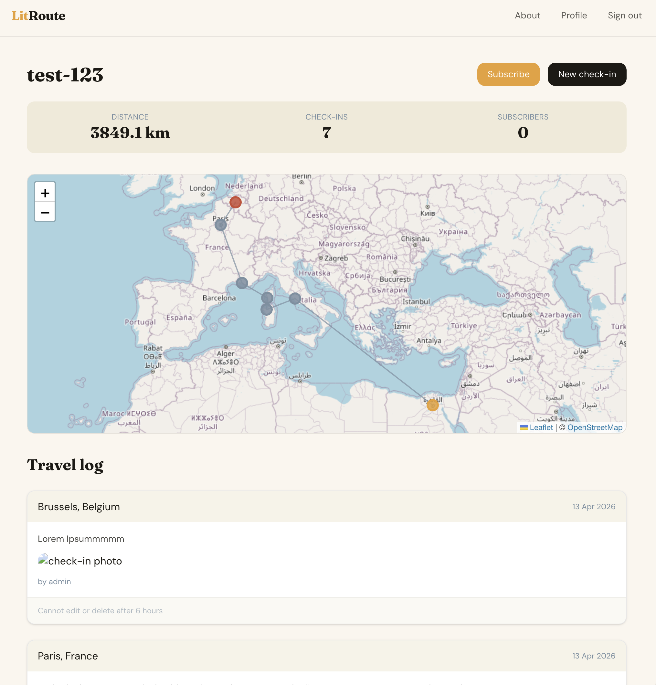

# LitRoute

Track a lighter as it travels between people, places, and stories.

[](https://python.org)
[](https://djangoproject.com)
[](https://github.com/astral-sh/uv)
[](https://github.com/astral-sh/ruff)

[](https://react.dev)
[](https://typescriptlang.org)
[](https://tailwindcss.com)
[](https://nodejs.org)

[](https://postgresql.org)
[](https://redis.io)
[](https://docs.celeryq.dev)
[](https://docker.com)



## Local development

All local dev runs through Docker via [`just`](justfile):

```bash
just build   # build images
just up      # start all services
just down    # stop services
```

See the `justfile` for the full command list (`just manage`, `just logs`, etc.).

## License

MIT
